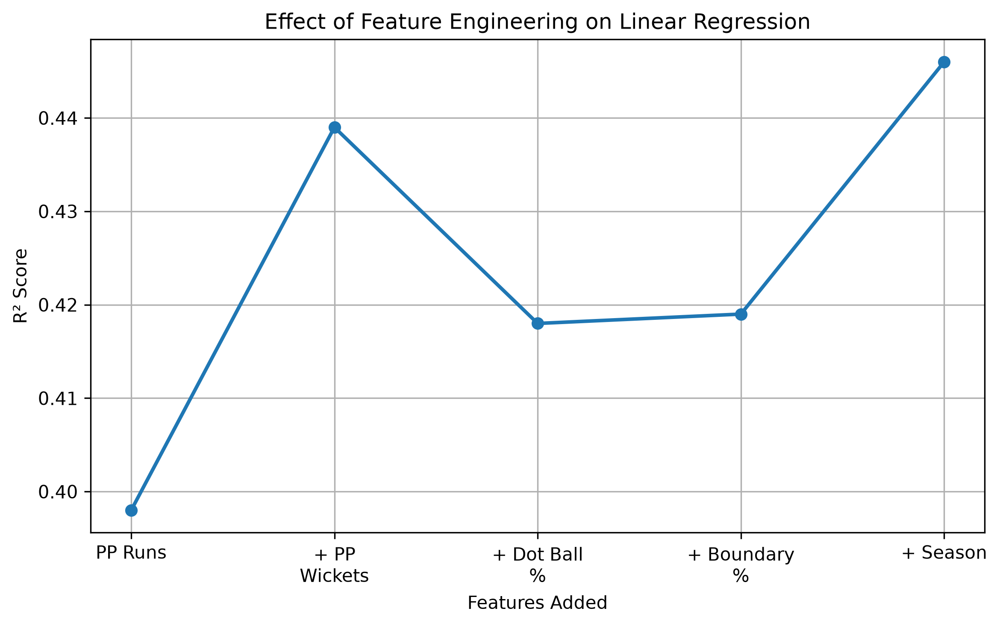
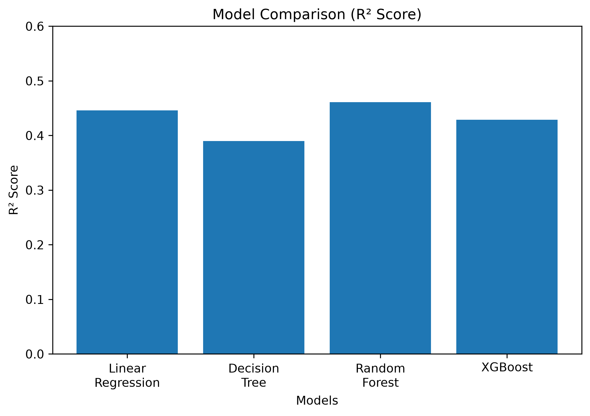

# 🏏 IPL First Innings Score Prediction using Machine Learning

Predicting the final first innings score of an IPL match immediately after the completion of the Powerplay (6 overs) using Machine Learning.

---

## 📌 Project Overview

The first six overs (Powerplay) often determine the momentum of an innings. This project attempts to predict the **final first innings total** after only the Powerplay has been completed.

Using ball-by-ball IPL data from **2022–2026**, several machine learning algorithms were trained and compared to determine which model best predicts the final score.

---

## 🎯 Problem Statement

Can the final first innings score be accurately predicted after just six overs?

This project investigates that question using machine learning and compares multiple regression algorithms.

---

## 📂 Dataset

- IPL Ball-by-Ball Dataset
- Seasons Included:
  - 2022
  - 2023
  - 2024
  - 2025
  - 2026

### Data Cleaning

- Removed rain-affected innings
- Aggregated ball-by-ball data into innings-level statistics
- Removed incomplete first innings
- Generated innings-level features

---

## ⚙️ Feature Engineering

The following features were created for every innings:

| Feature | Description |
|----------|-------------|
| PP Runs | Runs scored during Powerplay |
| PP Wickets | Wickets lost during Powerplay |
| Dot Ball Percentage | Percentage of legal deliveries resulting in dot balls |
| Boundary Percentage | Percentage of legal deliveries resulting in boundaries |
| Season | One-Hot Encoded IPL Season |

### Feature Experimentation

The batting team was also evaluated as an additional feature.

Although it appeared to be an important cricketing factor, it consistently reduced model performance (higher MAE/RMSE and lower R²). Therefore, it was excluded from the final models.

---

## 📊 Exploratory Data Analysis

Performed exploratory analysis including:

- Correlation Matrix
- Powerplay Runs vs Final Score
- Powerplay Wickets vs Final Score
- Dot Ball Percentage vs Final Score
- Boundary Percentage vs Final Score

Key observations:

- PP Runs showed the strongest positive correlation with Final Score.
- Dot Ball Percentage showed a strong negative relationship.
- Boundary Percentage positively influenced the final score.
- PP Wickets negatively affected the final innings total.

---

## 🤖 Models Implemented

The following regression models were implemented and compared.

### 1. Linear Regression

Feature engineering was performed incrementally to understand how each feature affected model performance.

Features were added in the following order:

- PP Runs
- PP Wickets
- Dot Ball Percentage
- Boundary Percentage
- Batting Team
- Season

This helped determine which features genuinely improved prediction accuracy.

---

### 2. Decision Tree Regressor

Hyperparameters explored:

- max_depth

---

### 3. Random Forest Regressor

Hyperparameters explored:

- n_estimators
- max_depth
- max_features

---

### 4. XGBoost Regressor

Hyperparameters explored:

- learning_rate
- max_depth
- subsample
- colsample_bytree
- n_estimators

---
## 📈 Model Comparison

The performance of the implemented models is summarized below.

| Model | MAE | RMSE | R² |
|--------|------|------|------|
| Linear Regression (PP Runs only) | 21.74 | 27.20 | 0.398 |
| Linear Regression (+ PP Wickets) | 22.16 | 26.25 | 0.439 |
| Linear Regression (+ Dot Ball %) | 22.57 | 26.74 | 0.418 |
| Linear Regression (+ Boundary %) | 22.56 | 26.72 | 0.419 |
| Linear Regression (+ Season) | **21.89** | 26.08 | 0.446 |
| Random Forest | **21.35** | **25.72** | **0.461** |
| XGBoost | 22.17 | 26.48 | 0.429 |

### 📊 Feature Engineering Progression

The chart below illustrates how the performance of the Linear Regression model changed as additional features were introduced.



---

### 📈 Final Model Comparison

Comparison of the final machine learning models based on **R² Score**.



---

## 📌 Key Findings

---

## 📌 Key Findings

- PP Runs is the strongest predictor of the final innings score.
- PP Wickets significantly improve prediction accuracy.
- Dot Ball Percentage and Boundary Percentage showed meaningful correlations but did not consistently improve Linear Regression performance.
- Adding IPL Season slightly improved model performance, reflecting the evolution of scoring trends across seasons.
- Batting Team did not improve predictive performance and was excluded from the final models.
- Random Forest achieved the best overall performance.

---

## 📉 Limitations

Predicting the final score after only six overs is inherently difficult because many important factors are unknown at prediction time, including:

- Venue
- Bowling Team
- Pitch Conditions
- Middle-over batting
- Death-over acceleration
- Match situation

These missing factors introduce uncertainty that limits prediction accuracy.

---

## 🚀 Future Improvements

Potential future enhancements include:

- Venue as an input feature
- Bowling Team
- Historical venue average
- Player-level statistics
- Batter and bowler ratings
- Pitch characteristics
- Live Streamlit web application
- Hyperparameter optimization using GridSearchCV

---

## 🛠️ Technologies Used

- Python
- Pandas
- NumPy
- Matplotlib
- Scikit-learn
- XGBoost

---

## 📁 Repository Structure

```
ipl-first-innings-score-prediction/
│
├── README.md
├── requirements.txt
├── data/
│   ├── matches.csv
│   └── deliveries.csv
├── notebooks/
│   └── IPL_First_Innings_Prediction.ipynb
├── images/
├── results/
│   └── model_comparison.csv
└── .gitignore
```

---

## 📌 Conclusion

This project demonstrates an end-to-end machine learning workflow including:

- Data Cleaning
- Feature Engineering
- Exploratory Data Analysis
- Model Development
- Hyperparameter Tuning
- Model Evaluation
- Performance Comparison

The results suggest that while machine learning can reasonably estimate the final innings score after the Powerplay, additional contextual features such as venue, bowling quality and pitch conditions are likely required for substantially higher prediction accuracy.
